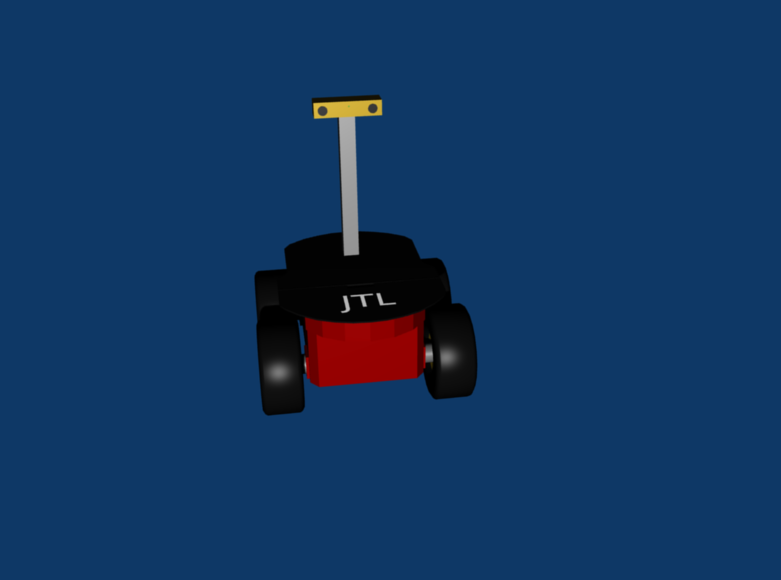

# pioneer3-model
A 3D Model of ActivMedia Robotics Pioneer 3 as used at JTL

 * modeled in Blender

# How it looks like

The base model is taken form [here](https://github.com/balakumar-s/p3atGazeboRos).
